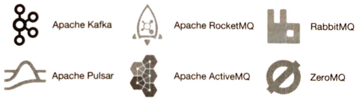
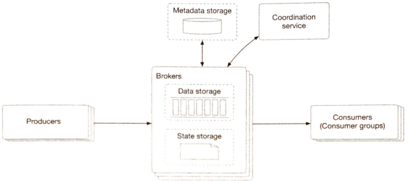
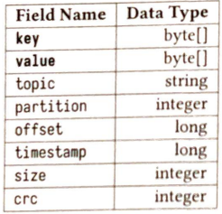
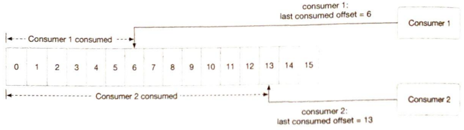
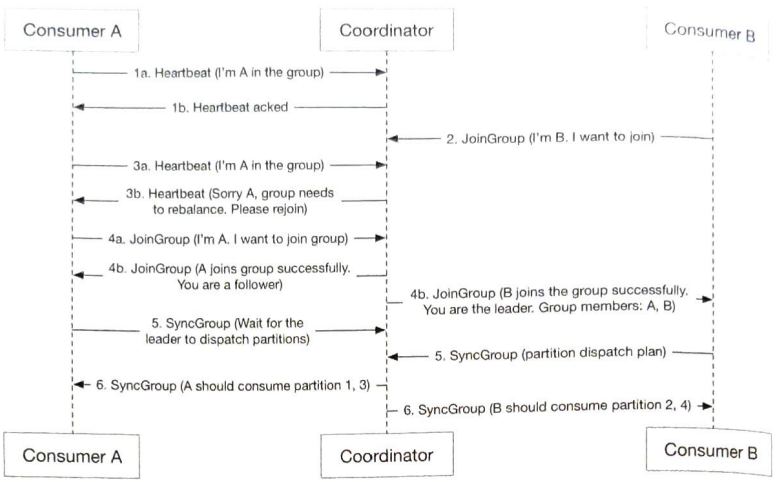

# Chapter 4. Distributed Message Queue

It's almost just explaining kafka. Strictly speaking, Apache Kafka and Pulsar are not **message queues** as they are **event streaming platforms**. However, there is a convergence of features that starts to blur the distinction between message queus.

    

## 4.1. FR & NFR

### FR

- Producers produce messages / Consumers consume messages(~KB)
- Messages can be consumed repeatedly or only once
- Historical data can be truncated
- Can deliver messages in the order they were added to the queue
- Data delivery semantics (at least once, at most once, exactly once)

### NFR

- Can choose high throuput vs low latency
- Scalable (distributed) so that fault tolerance
- Persistent and durable data

## 4.2. Propose High-level Design

### 4.2.1. Point-to-Point vs Publish-subscribe

In a **point-to-point** model, a message is sent to a queue and consumed by one and only one consumer. Once the consumer acknowledges that a message is consumed, it is removed from the queue. Meanwhile, **pub-sub** model, a message is sent to a topic and received by the consumers subscribing to this topic. Our project supports both models (if we put all consumers in the same consumer group, it's point-to-point model)

    

As we partition a topic, delivery order can be broken if many consumers consume the same partition. So a single partition can only be consumed by one consumer in the same group. If the number of consumers of a group is larger than the number of partitions of a topic, some consumers will not get data from this topic. (e.g. Consumer-3 cannot get data from Topic-B)

To maintain these complex structure and configurations, we introduce high level design as below:

    

- Broker: holds multiple partitions. A partition holds a subset of messages for a topic
- Data storage: messages are persisted in data storage in partitions
- State storage: manages consumer states
- Metadata storage: manages configuration and properties of topics
- Coordination service
  - Service discovery: which brokers are alive
  - Leader election: one of the brokers is selected as the active controller (ZooKeeper/etcd)

## 4.3. Design Deep Dive

### 4.3.1. Data storage, I/O efficiency

Message's traffice pattern is write-heavy, read-heavy, almost no delete, and predominantly sequential read/write access. Instead of database solution that is hard to design our access patterns at a large scale, we use **WAL**(Write-ahead log).

A new message is appended to the tail of a segment. When the active segment reaches a certain size, a new active segment is created to receive new messages, and the currently active segment becomes inactive, like the rest of the non-active segments.

    

The data structure of a message is key to high throughput. It defines the contract between the producers, message queue, and consumers. `key` field determines which partition the message goes.

    

- key is not unique. Message goes to the partition `hash(key) % numPartitions`
- offset: the position of the message in the partition
- CRC: Cyclic redundancy check to ensure the integrity of raw data

Small I/O is an enemy of high throughput. So, wherever possible, our design encourages **batching**. But there is a tradeoff between throughput and latency. If the system is deployed as a traditional message queue where latency might be more important, the system could be turned to use a smaller batch size. Disk performance will suffer in this use case. If tuned for throuput, there might need to be a higher number of partitions per topic to make up for the slower sequential disk write throughput.

### 4.3.2. Producer flow

Each partition could be replicated. And one of them is the leader replica. Producer should send messages to the broker which holds the leader replica of one of the partitions(determined by the key of the message and producer's logic) of the topic. To do so, producer's traffic must be routed somehow. So we introduce routing layer. Also, to in crease throughput, we introduce buffer.

    

### 4.3.3. Consumer flow

    

An important question to answer is whether brokers should push data to consumers, or if consumers should pull data from the brokers. **Push model** has low latency, but if the rate of consumption falls below the rate of production, consumers could be overwhelmed. **Pull model**, in contrast, consumers control the consumption rate. If the rate of consumption falls below the rate of production, we can scale out the consumers, or simply catch up when it can. When there is no message in the broker, a consumer might still keep pulling data, wasting resources. But long polling mode, which allows pulls to wait a specified amount of time for new messages, overcomes this.

    

### 4.3.4. State storage, Metadata storage

**State storage** holds the mapping between partitions and consumers, the last consumed offsets of consumer groups for each partition. **Metadata storage** stores the configuration and properties of topics, including a number of partitions, retention period, and distribution of replicas. These datas are accessed read/write frequently, but volume is not high. Access pattern is random read/write, and data consistency is important. For this reason, we use **ZooKeeper** for State & Metadata storage.

    

### 4.3.5. Others: ISR, Delivery

**ISR** reflects the trade-off between performance and durability. If producers don't want to lose any messages, the safest way to do that is to ensure all replicas are already in sync before sending an acknowledgment. But a slow replica will cause the whole partition to become slow or unavailable. (ACK=all, 1, 0)

|   |producer|consumer|
|---|---|---|
|At most once|ACK=0|auto commit|
|At least once|ACK=1/all|commit after proceeded|
|Exactly once|Idempotent(kafka support this)|Idempotent|
