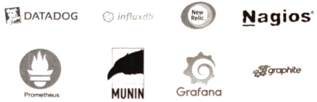
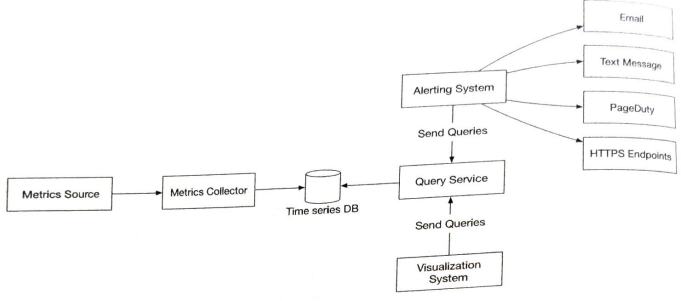
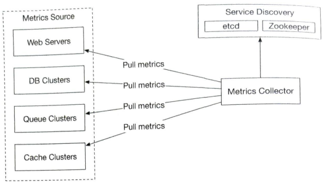
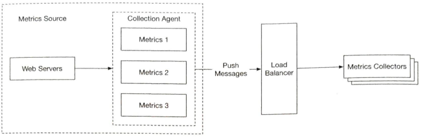
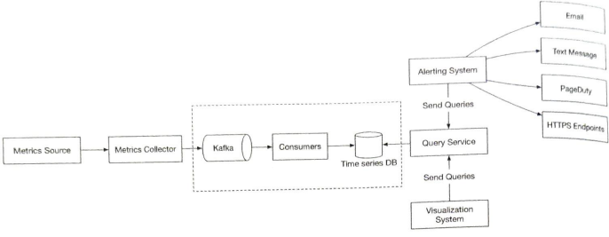
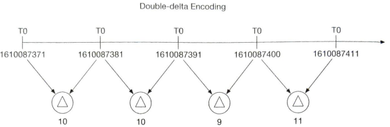

# 5. Chapter 5. Metrics Monitoring and Alerting System

It's explaining general metrics monitoring stack using:

    

## 5.1. FR & NFR

### FR

- 10^8 DAU (metrics includes request count)
- 1000 server pools, 100 machines per pool, 100 metrics per machine => 10^7 metrics
- 1y data retention
- data retention policy:
  - raw 7 days
  - 1m resolution (downsampling) 30 days
  - 1h resolution 1 year

### NFR

- Scalability. Metrics and alert volume grows. System must handle this
- Low latency for dashboards and alerts
- Reliability to avoid missing critical alerts
- Flexibility. Pipeline should be easy to integrate new technologies.

## 5.2. Propose High-level Design

There are five fundamental functionalities:
- Data collection
- Data transmission
- Data storage
- Alerting
- Visualization

These leads directly to intuitive architecture, but let's consider how data should be stored, and queried.

Metrics data is usually recorded as a time seried that contains a set of values with their associated timestamps. The series itself can be uniquely identified by its name, and optionally by a set of labels. e.g:

- CPU load on production server 1 at 20:00?
- Average CPU load across all web servers in the us-west region for the last 10 minutes?

We can imagine that write load is heavy since 10^7 metrics are written in real-time, and read load is spiky since read ops only occurs when someone access monitoring ui, or alert system queries to the database.

RDB is not optimized for operations you would commonly perform against time-series data. For example, computing the moving average in a rolling time window.

There are many storage systems available that are optimized for time-series data. The optimization lets us use far fewer servers to handle the same volume of data. Many of these databases also have custom query interfaces specially designed for the analysis of time-series data. The two most popular time-series databases are **InfluxDB** and **Prometheus**.

    

Query service makes it easy to query and retrieve data from the time-series database. This should be a very thin wrapper if we choose a good time-series database. It could also be entirely replaced by the time-series database's own query interface.

## 5.3. Design Deep Dive

### 5.3.1. Metrics Collection - Pull vs Push

#### Pull model

    

1. Metrics Collector first fetches configuration metadata of service endpoints from Service Discovery Service(etcd, ZooKeeper). Metadata include pulling interval, IP addresses, timeout and retry parameters, etc. 

2. Metrics Collector should select which endpoints it should handle. One potential approach is to designate each collector to a range in a consistent hash ring, and then map every single server being monitored by its unique name in the hash ring.

3. The metrics collector pulls metrics data via a pre-defined HTTP endpoint (e.g. /metrics).

4. Optionally, the metrics collector registers a change event notification with Service Discovery to receive an update whenever the service endpoints changes. Alternatively, the metrics collector can poll for endpoint changes periodically.

#### Push model

    

1. Collection agent is commonly installed on every server being monitored.
2. Collection agent collects metrics from the services running on the server and pushes those metrics periodically to the metrics collector. Metrics may also be aggregated.
3. To prevent the metrics collector from falling begind in a push model, the metrics collector should be in an auto-scaling cluster with a load balancer in front of it.

### 5.3.2. Scale the metrics transmission pipeline

What if write data spikes? Or, Time series DB is unavailable for a while? Facebook's Gorilla in-memory time-series db is highly available for writes, but let's consider scaling the pipeline for a while.

We introduce a queueing component as below:

    

Kafka decouples the data collection and data processing services from each other. It can easily prevent data loss when the database is unavailable, by retaining the data in kafka.

### 5.3.3. Query service

You might want to use cache when building query service. But since most industrial-scale visual and alerting systems have powerful plugins to interface with well-known time-series databases on the market. And with a well-chosen time-series database, there is no need to add our own caching, either.

### 5.3.4. Storage layer

According to a research paper published by Facebook, at least 85% of all queries to the operational data store were for data collected in the past 26 hours. If we use a time-series database that harnesses this property, it could have a significant impact on overall system performance.

#### Data encoding and compression

    

Instead of the full timestamp of 32 bits, we could save first 32 bit and then 4 bits of diffs, like 1610087371, 10, 10, 9, 11.

#### Downsampling

It's a process of converting high-resolution data to low-resolution to reduce overall disk usage. For example:

- raw data : 7 days
- 1min resolution : 30 days
- 1hour resolution : 1 year

we could then move old data to the cold storage.

