# 6. Chapter 6. Ad Click Event Aggregation

Digital advertising has a core process called Real-Time Bidding, in which digital advertising inventory is bought and sold. Speed of the RTB process is important, and also Data accuracy.

    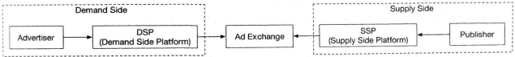

## 6.1. FR & NFR

### FR

- Aggregate number of clicks of `ad_id` in the last $M$ minutes
- Top 100 most clicked `ad_id` every minute (numbers can be changed)
- Aggregation filtering
- 1 bilion ad clicks per day, 2 milion ads in total.
  - 1 bilion / 1 day ~ 10^9/10^5 = 10,000 QPS
  - Assume peak QPS x5 = 50,000 QPS
  - Assume ad click data 0.5KB -> 5GB/s, 100GB/day, 3TB/month

### NFR

- Correctness of the aggregation result
- Properly handle delayed or duplicate events
- Robustness
- Latency

## 6.2. Propose High-level Design

### 6.2.1. API and data model

Our client is the dashboard user (data scientist, product manager, advertiser, etc.) who runs queries against the aggregation service.

- API 1: Aggregate the number of clicks of `ad_id` in the last $M$ minutes

| API                                   | Params                                   | Response                          |
| ------------------------------------- | ---------------------------------------- | --------------------------------- |
| GET /v1/ads/{:ad_id}/aggregated_count | from long to long  filter long | ad_id: string  count: string |

\* filter: An identifier for different filtering strategies

- API 2: Return top $N$ most clicked `ad_id`s in the last $M$ minutes

| API                     | Params                                             | Response      |
| ----------------------- | -------------------------------------------------- | ------------- |
| GET /v1/ads/popular_ads | count integer window integer filter long | ad_ids: array |

\* window: The aggregation window size ($M$) in minutes.

We should also save aggregated data to reduce computation. Also, we add filter when aggregation.

    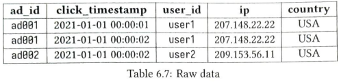
    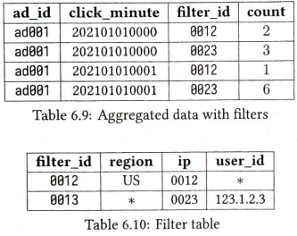

Is's a good idea to keep the raw data. If something goes wrong, we could use the raw data for debugging, and can recalculate the aggregated data when aggregated data is corrupted due to a bad bug. But since it's a lot of data, old raw data could be moved to cold storage to reduce cost.

Aggregated data should be stored as well since the data size of the raw data is huge and querying directly from raw data is very inefficient.

### 6.2.2. Database

When it comse to choosing the right database, we need to evaluate the following:

- What does the data look like? Is the data relational? Document? Blob?

  - raw : timeseries
  - agg : timeseries

- Is the workflow read-heavy, write-heavy, or both?

  - raw : write-heavy (peak 50,000 QPS)
  - agg : both (write every minute, read two milion ads)

- Is transaction support needed?

  - raw : no
  - agg : mp

- Do the queries rely on many OLAP functions like SUM, COUNT?
  - raw : no
  - agg : might be

=> Consider Column-oriented `Cassandra`, or timeseries `InfluxDB`

### 6.2.3. High level Design

We could think the design as simple as possible as this:

    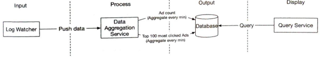

This is not good because the capacity of producers and consumers is not always equal. If one component is the synchronous link is down, the whole system stops working. A common solution is to adopt a message queue (Kafka) to decouple producers and consumers. This makes the whole process asynchronous and producers/consumers can be scaled independently.

    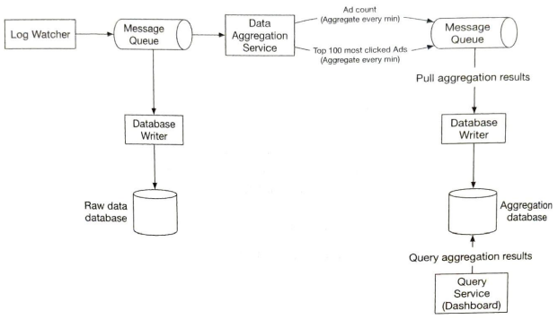

By adding MQ at the front, it enables producers/consumers to scale independently. And second MQ makes easy to support exactly-once delivery of the aggregated message. [exactly-once](./exactly-once.md)

### 6.2.4. Aggregation service

The MapReduce framework is a good option to aggregate ad click events. The DAG is a good model for it.

#### UC1. Aggregate the number of clicks

Input events are partitioned by `ad_id` % $N$ in Map nodes and are then aggregated by Aggregation nodes.

    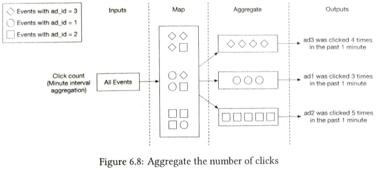

#### UC2. Return top $N$ most clicked ads

Input events are partitioned by `ad_id` % $N$ in Map nodes and each Aggregate node maintains a heap data structure to get the top $N$ ads within the node efficiently. It's reduced in the last Reduce node.

    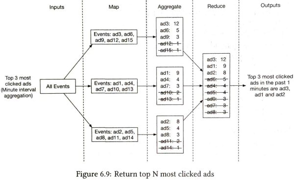

## 6.3. Design Deep Dive

### 6.3.1. Data recalculation

Sometimes we have to recalculate the aggregated data, also called historical data replay.

1. The recalculation service retrieves data from raw data storage. This is a batched job
2. Retrieved data is sent to a dedicated aggregation service so that the real-time processing is not impacted by historical data replay (seems it's same code, but different instanciated component)
3. Aggregated results are sent to the second message queue, then updated in the aggregation database.

    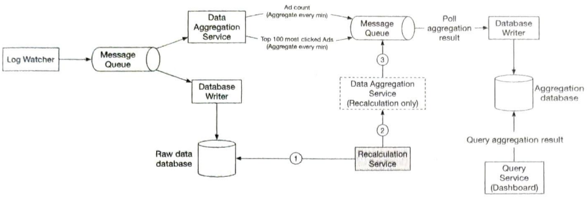

### 6.3.2. Time

We need a timestamp to perform aggregation. The timestamp can be generated in two different places:

    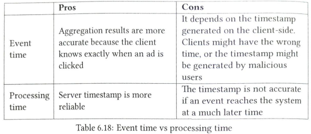
    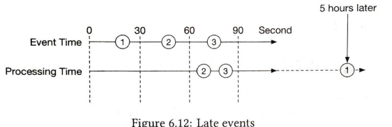

Since data accuracy is very important, we use event time for aggregation. But to compensate late events, we also use 'watermark' technique.

    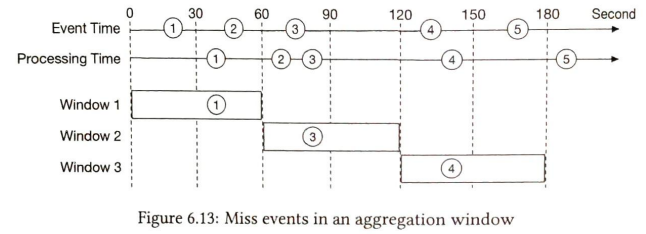
    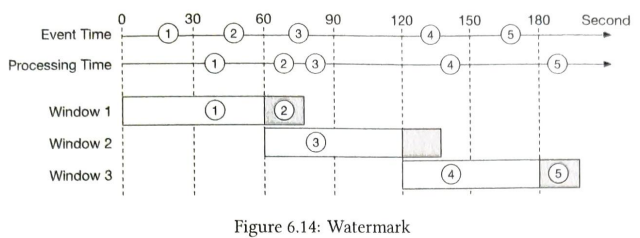

Note that the watermark technique does not handle events that have long delays. We can correct the remaining low probability events with end-of-day reconciliation.

We use tumbling window, which partitions time into same-length non-overlapping chunks, since it's good fit for aggregating ad click events every minute.

### 6.3.3. Delivery guarantee & Data deduiplication

Key idea is to save offset and put some operations in one distributed transaction. But kafka can handle that in the latest version.

    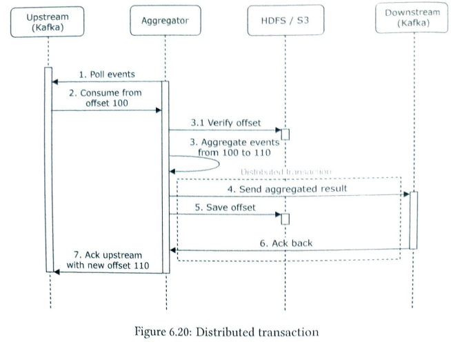

### 6.3.4. Scale the system

Scaling the MQ producer, consumer, brokers are easy since we designed that way. (For detail, see the book) Using MapReduce framework, it's not hard to scale them too. But we need to deal with _Hotspot Issue_:

Since events are partitioned by `ad_id`, some aggregation service nodes might receive many more ad click events than others, potentially causing server overload. We could use Resource Manager to allocate extra resources to aggregation node.

    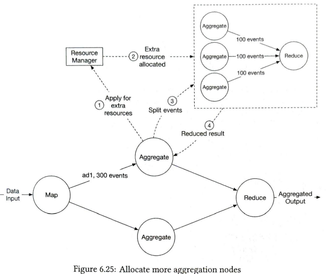

### 6.3.5. Reconsiliation

Reconciliation means comparing different sets of data in order to ensure data integrity. What we can do is to sort the ad click events by event time in every partition at the end of the day, by using a batch job and reconciling with the real-time aggregation result.

This is the final, generic design that is not specialized for this domain:

    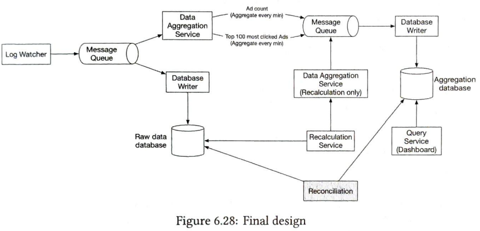

Alternatively, specialized person can design as below:

    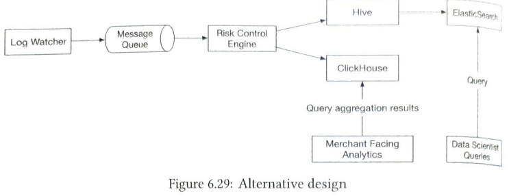

