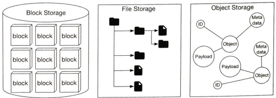
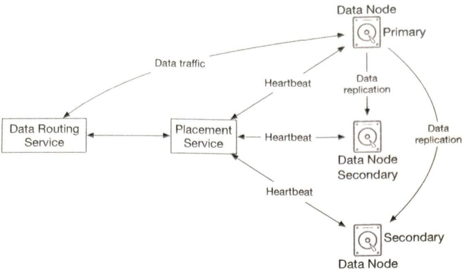
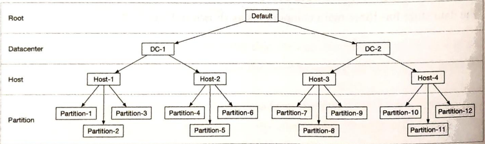
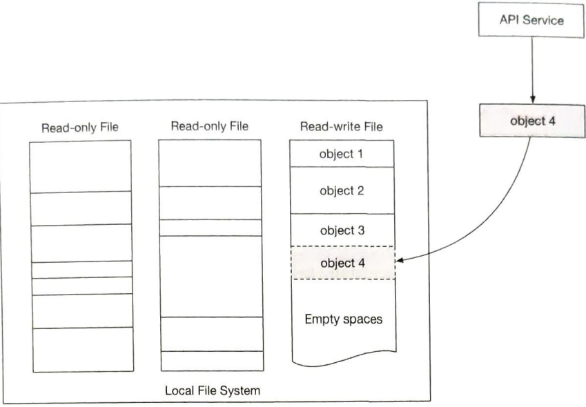
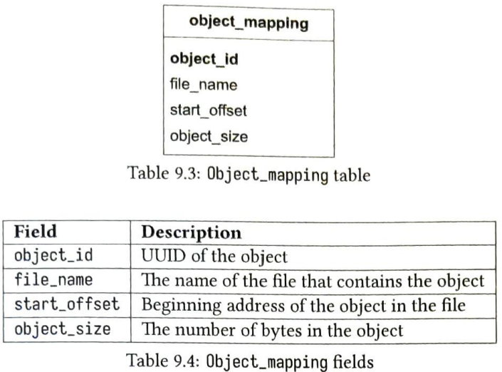
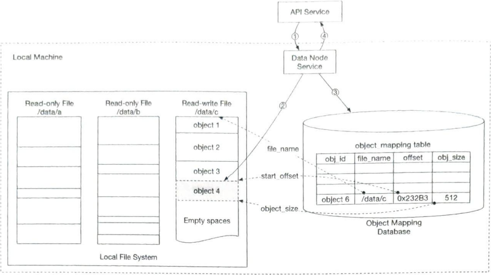
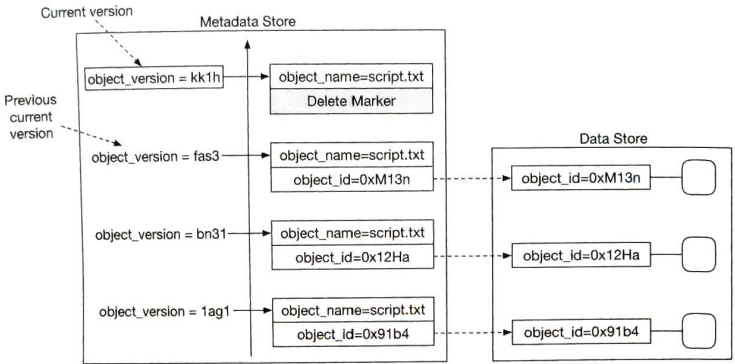
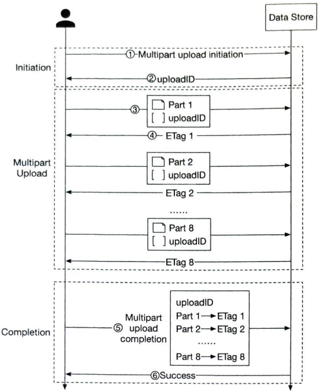
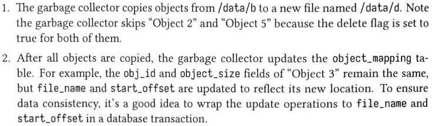

# Chapter 9. S3-like Object Storage

Object Storage, Virtual cluster map, Erasure coding, Correctness verification, Versioning, Multipart upload, Garbage collection
<p align="center">
    
    
</p>

## 9.1. FR & NFR

### FR

- Bucket creation
- Object uploading and downloading
- Object versioning
- Listing objects in a bucket
- object size from few KBs to GBs or more

### NFR

- 100 PB per year
- data durability 6 nines (99.9999%)
- availability 4 nines (99.99%)
- Reduce storage costs while maintaining high degree of reliability and performance

## 9.2. Propose High-level Design

Objects stored inside of object storage are immutable.
Like key-value store, object storage retrieves object data using objects' id.
Most object data is written once and read many times.
Separating metadata and object data simplifies the design like:

<p align="center">
    
</p>

High level design looks like:

<p align="center">
    
</p>


## 9.3. Design Deep Dive

### 9.3.1. Data Store

#### services
<p align="center">
    
</p>

`Data Routing Service` provides APIs to access data node cluster. It queries the placement service to get the best data node to store data. It reads data from data nodes and return to API service. It writes data to data nodes. This service is stateless. (Have to choose when to returnto API service: consistency(replication) vs latency(min replica))

`Placement Service` determines which data nodes (primary and replicas) should be chosen to store an object. It maintains virtual cluster map to do so as picture below. Also, it uses heartbeat to continuously monitor all data nodes. Since this service is not stateless, need to use consensus algorithm to build cluster.

<p align="center">
    
</p>

`Data Node` has a data service daemon running on it. It sends heartbeats to the placement service continuously. This message includes number of disks the node manage, and how much data is stored on each drive.

#### data organization

If we store each object as file, performance suffers for many small files: 
- wastes many data blocks (typical block size 4KB, files smaller than 4KB will waste blocks)
- could exceed inode capacity.

So we use larger files like WAL(write-ahead log). When we save an object, it is appended to an existing read-write file. When the read-write file reaches its capacity threshold(few GBs), the read-write file is marked as read-only and a new read-write file is created.

<p align="center">
    
</p>

Note that writing a file must be serialized. Multiple cores processing incoming write requests in parallel must take their turns to write to the read-write file. Since this can seriously restrict write throughput, we can provide each core separate read-write file.

#### object lookup & managing

To lookup, object mapping information should be maintained.

<p align="center">
    
</p>

Since this information doesn't need to be shared across data nodes, we just use SQLite in each Data Nodes. 

Combining informations above, updating data persistence flow shows:

<p align="center">
    
</p>

#### Erasure coding

Replicating full data makes sense with durability, but it costs xN times more. So we use erasure coding for cost reduction. It chunks data into smaller pieces and creates parities for redundancy. There are lots of algorithms to do this. This slows down access speed since we need to make mathematical calculation for getting a single file, but it's acceptable.

<p align="center">
    
</p>

#### Correctness verification

There are many checksum algorithms like MD5, SHA1, HMAC, etc.
We save checksum with object, and check if that object is corrupted.

<p align="center">
    
</p>


### 9.3.2. Metadata data model

Metadata Service must support these three queries: 
1. Find the object ID by object name
2. Insert and delete an object by object name
3. List objects in a bucket sharing the same prefix
<p align="center">
    
</p>

Bucket table is read intensive. So we spread the read load among multiple database replicas.

Object table is both read/write intensive. We should shard by (bucket_name, object_name) because most of the metadata operations are based on the object URI, which contains (bucket_name, object_name). 

### 9.3.3. Listing objects in a bucket

Object storage arranges file in a flat structure instead of a hierarchy, like a file system. But it supports hierarchy-like access:

```
s3://bucket-name/this/is/not/a/folder/file.txt

Bucket name: bucket-name
Object name: this/is/not/a/folder/file.txt
```
To provide pagination of listing objects, we could make separate table sharded with bucket id. This will not have optimal performance, but it greatly simplifies the implementation.

### 9.3.4. Object versioning

If `PUT` request comes:
- without `enable_versioning`, old version's metadata is replaced by the new version in the metadata store. Old version's document is marked as deleted, and garbage collector will reclaim that storage space. (same for versioning's `DELETE`)
- with `enable_versioning`, it just adds new document and metadata with new version.

<p align="center">
    
</p>


### 9.3.5. Optimizing uploads of large files

For large objects, we can provide `multipart upload` scheme.

<p align="center">
    
</p>
1~2 : Client calls object storage to initiate multipart upload. Server returns uploadID
3~4 : Client splits a file and start uploading with Part's ID and uploadID. Server returns ETag(checksum) for that file
5~6 : Client sends 'complete' message with uploadID, pairs of Part's ID and ETag. Server reassembles the object.

One problem is that splitted parts are no longer useful after reassemble. To solve this, gc must be implemented.

### 9.3.6. Garbage collection

<p align="center">
    
    
</p>

To avoid creating a lot of small files, gc waits until there are a large number of read-only files to compact, and makes many read-only files into a few large new files.
