# Index
- Geolocational Relation data services
  - Chapter 1. Proximity Service
  - Chapter 2. Nearby Friends
  - Chapter 3. Google Maps
- Loosely coupled message queue System
  - [Chapter 4. Distributed Message Queue](#chapter-4-distributed-message-queue)
  - Chapter 5. Metrics Monitoring and Alert System
  - Chapter 6. Ad click Event Aggregation
- Reservation System
  - Chapter 7. Hotel Reservation System
- Email System
  - Chapter 8. Distributed Email Service
- Data Storage
  - [Chapter 9. S3-like Object Storage](#chapter-9-s3-like-object-storage)
- Game System
  - Chapter 10. Real-time Gaming Leaderboard
- Currency Exchange Integrity
  - Chapter 11. Payment System
  - Chapter 12. Digital Wallet
  - Chapter 13. Stock Exchange


# Chapter 4. Distributed Message Queue

It's almost just explaining kafka. Strictly speaking, Apache Kafka and Pulsar are not **message queues** as they are **event streaming platforms**. However, there is a convergence of features that starts to blur the distinction between message queus.

<p align="center">
    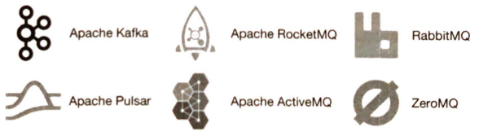
</p>

## 4.1. FR & NFR

### FR

- Producers produce messages / Consumers consume messages(~KB)
- Messages can be consumed repeatedly or only once
- Historical data can be truncated
- Can deliver messages in the order they were added to the queue
- Data delivery semantics (at least once, at most once, exactly once)

### NFR

- Can choose high throuput vs low latency
- Scalable (distributed) so that fault tolerance
- Persistent and durable data

## 4.2. Propose High-level Design

### 4.2.1. Point-to-Point vs Publish-subscribe

In a **point-to-point** model, a message is sent to a queue and consumed by one and only one consumer. Once the consumer acknowledges that a message is consumed, it is removed from the queue. Meanwhile, **pub-sub** model, a message is sent to a topic and received by the consumers subscribing to this topic. Our project supports both models (if we put all consumers in the same consumer group, it's point-to-point model)

<p align="center">
    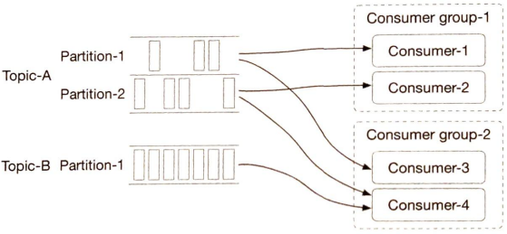
</p>

As we partition a topic, delivery order can be broken if many consumers consume the same partition. So a single partition can only be consumed by one consumer in the same group. If the number of consumers of a group is larger than the number of partitions of a topic, some consumers will not get data from this topic. (e.g. Consumer-3 cannot get data from Topic-B)

To maintain these complex structure and configurations, we introduce high level design as below:

<p align="center">
    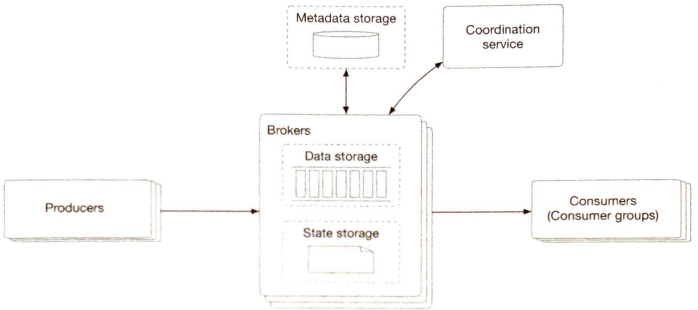
</p>

- Broker: holds multiple partitions. A partition holds a subset of messages for a topic
- Data storage: messages are persisted in data storage in partitions
- State storage: manages consumer states
- Metadata storage: manages configuration and properties of topics
- Coordination service
  - Service discovery: which brokers are alive
  - Leader election: one of the brokers is selected as the active controller (ZooKeeper/etcd)


## 4.3. Design Deep Dive

### 4.3.1. Data storage, I/O efficiency

Message's traffice pattern is write-heavy, read-heavy, almost no delete, and predominantly sequential read/write access. Instead of database solution that is hard to design our access patterns at a large scale, we use **WAL**(Write-ahead log).

A new message is appended to the tail of a segment. When the active segment reaches a certain size, a new active segment is created to receive new messages, and the currently active segment becomes inactive, like the rest of the non-active segments.

<p align="center">
    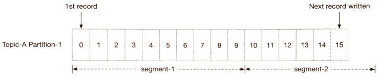
</p>

The data structure of a message is key to high throughput. It defines the contract between the producers, message queue, and consumers. `key` field determines which partition the message goes.

<p align="center">
    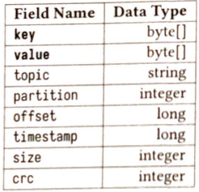
</p>

- key is not unique. Message goes to the partition `hash(key) % numPartitions`
- offset: the position of the message in the partition
- CRC: Cyclic redundancy check to ensure the integrity of raw data


Small I/O is an enemy of high throughput. So, wherever possible, our design encourages **batching**. But there is a tradeoff between throughput and latency. If the system is deployed as a traditional message queue where latency might be more important, the system could be turned to use a smaller batch size. Disk performance will suffer in this use case. If tuned for throuput, there might need to be a higher number of partitions per topic to make up for the slower sequential disk write throughput.


### 4.3.2. Producer flow

Each partition could be replicated. And one of them is the leader replica. Producer should send messages to the broker which holds the leader replica of one of the partitions(determined by the key of the message and producer's logic) of the topic. To do so, producer's traffic must be routed somehow. So we introduce routing layer. Also, to in crease throughput, we introduce buffer.

<p align="center">
    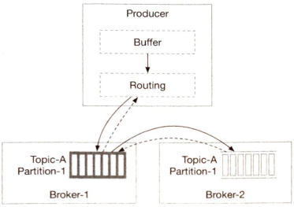
</p>


### 4.3.3. Consumer flow

<p align="center">
    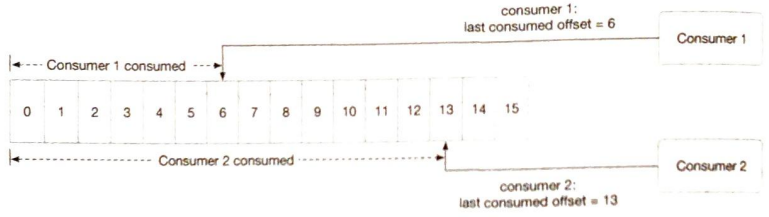
</p>

An important question to answer is whether brokers should push data to consumers, or if consumers should pull data from the brokers. **Push model** has low latency, but if the rate of consumption falls below the rate of production, consumers could be overwhelmed. **Pull model**, in contrast, consumers control the consumption rate. If the rate of consumption falls below the rate of production, we can scale out the consumers, or simply catch up when it can. When there is no message in the broker, a consumer might still keep pulling data, wasting resources. But long polling mode, which allows pulls to wait a specified amount of time for new messages, overcomes this.

<p align="center">
    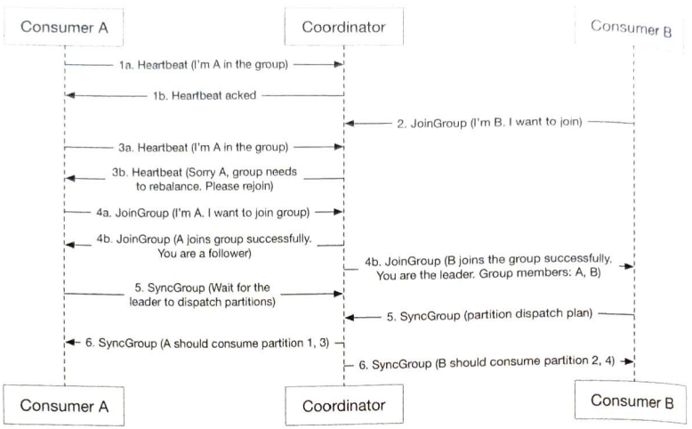
</p>

### 4.3.4. State storage, Metadata storage

**State storage** holds the mapping between partitions and consumers, the last consumed offsets of consumer groups for each partition. **Metadata storage** stores the configuration and properties of topics, including a number of partitions, retention period, and distribution of replicas. These datas are accessed read/write frequently, but volume is not high. Access pattern is random read/write, and data consistency is important. For this reason, we use **ZooKeeper** for State & Metadata storage.

<p align="center">
    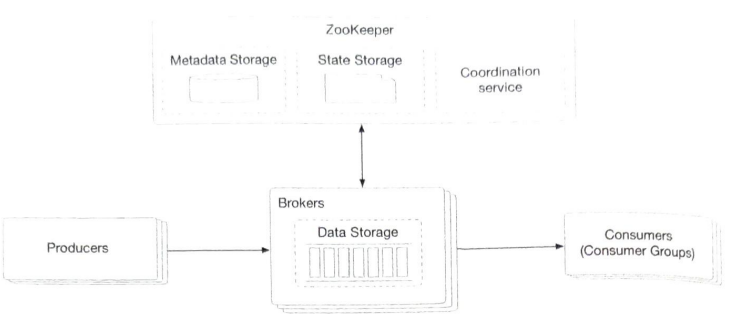
</p>


### 4.3.5. Others: ISR, Delivery

**ISR** reflects the trade-off between performance and durability. If producers don't want to lose any messages, the safest way to do that is to ensure all replicas are already in sync before sending an acknowledgment. But a slow replica will cause the whole partition to become slow or unavailable. (ACK=all, 1, 0)

|   |producer|consumer|
|---|---|---|
|At most once|ACK=0|auto commit|
|At least once|ACK=1/all|commit after proceeded|
|Exactly once|Idempotent(kafka support this)|Idempotent|


# Chapter 9. S3-like Object Storage

Object Storage, Virtual cluster map, Erasure coding, Correctness verification, Versioning, Multipart upload, Garbage collection
<p align="center">
    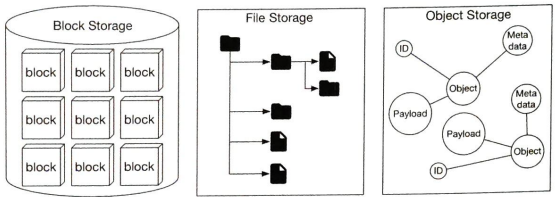
    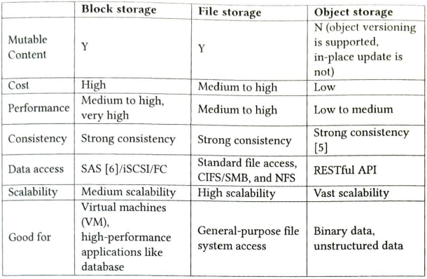
</p>

## 9.1. FR & NFR

### FR

- Bucket creation
- Object uploading and downloading
- Object versioning
- Listing objects in a bucket
- object size from few KBs to GBs or more

### NFR

- 100 PB per year
- data durability 6 nines (99.9999%)
- availability 4 nines (99.99%)
- Reduce storage costs while maintaining high degree of reliability and performance

## 9.2. Propose High-level Design

Objects stored inside of object storage are immutable.
Like key-value store, object storage retrieves object data using objects' id.
Most object data is written once and read many times.
Separating metadata and object data simplifies the design like:

<p align="center">
    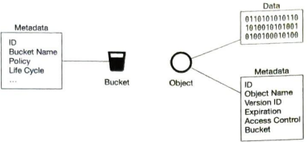
</p>

High level design looks like:

<p align="center">
    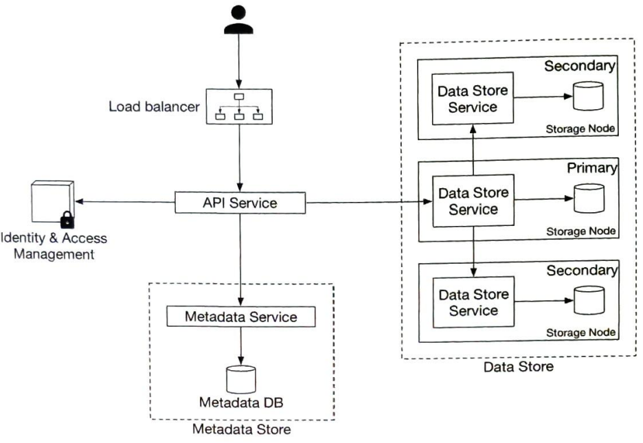
</p>


## 9.3. Design Deep Dive

### 9.3.1. Data Store

#### services
<p align="center">
    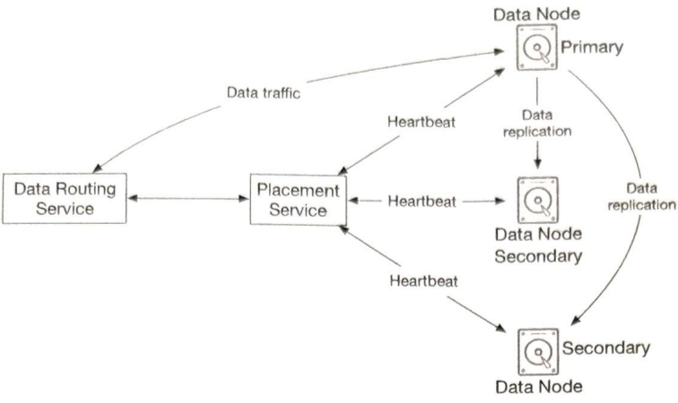
</p>

`Data Routing Service` provides APIs to access data node cluster. It queries the placement service to get the best data node to store data. It reads data from data nodes and return to API service. It writes data to data nodes. This service is stateless. (Have to choose when to returnto API service: consistency(replication) vs latency(min replica))

`Placement Service` determines which data nodes (primary and replicas) should be chosen to store an object. It maintains virtual cluster map to do so as picture below. Also, it uses heartbeat to continuously monitor all data nodes. Since this service is not stateless, need to use consensus algorithm to build cluster.

<p align="center">
    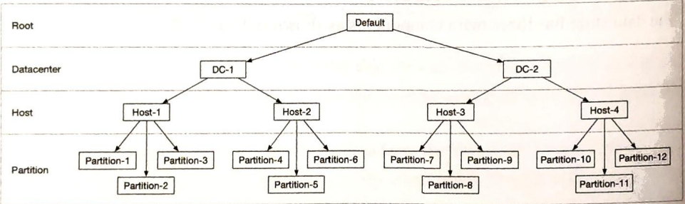
</p>

`Data Node` has a data service daemon running on it. It sends heartbeats to the placement service continuously. This message includes number of disks the node manage, and how much data is stored on each drive.

#### data organization

If we store each object as file, performance suffers for many small files: 
- wastes many data blocks (typical block size 4KB, files smaller than 4KB will waste blocks)
- could exceed inode capacity.

So we use larger files like WAL(write-ahead log). When we save an object, it is appended to an existing read-write file. When the read-write file reaches its capacity threshold(few GBs), the read-write file is marked as read-only and a new read-write file is created.

<p align="center">
    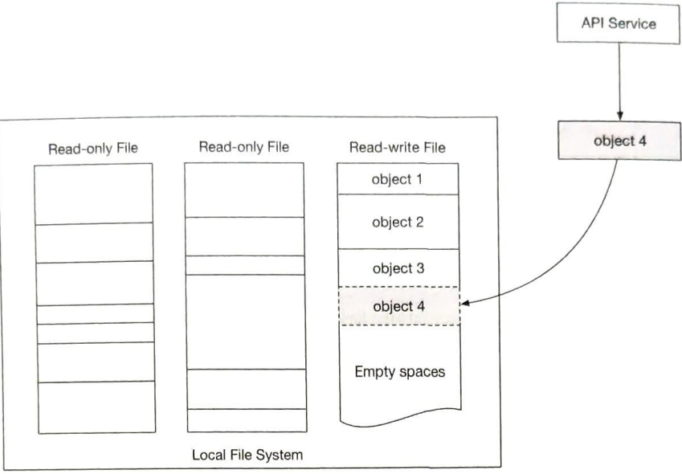
</p>

Note that writing a file must be serialized. Multiple cores processing incoming write requests in parallel must take their turns to write to the read-write file. Since this can seriously restrict write throughput, we can provide each core separate read-write file.

#### object lookup & managing

To lookup, object mapping information should be maintained.

<p align="center">
    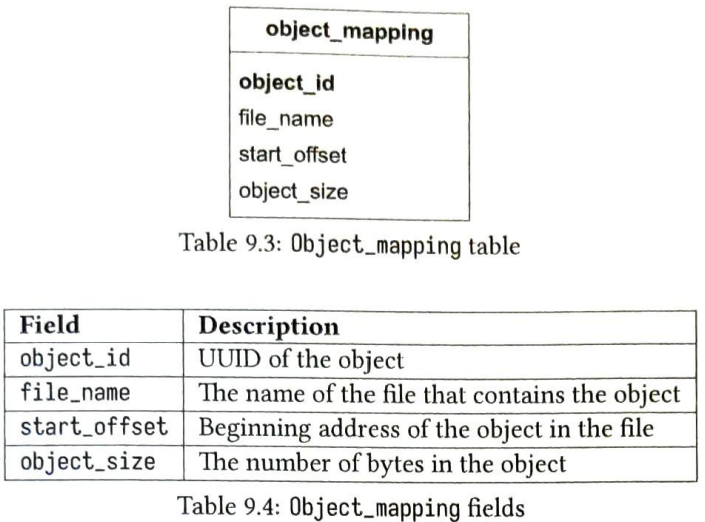
</p>

Since this information doesn't need to be shared across data nodes, we just use SQLite in each Data Nodes. 

Combining informations above, updating data persistence flow shows:

<p align="center">
    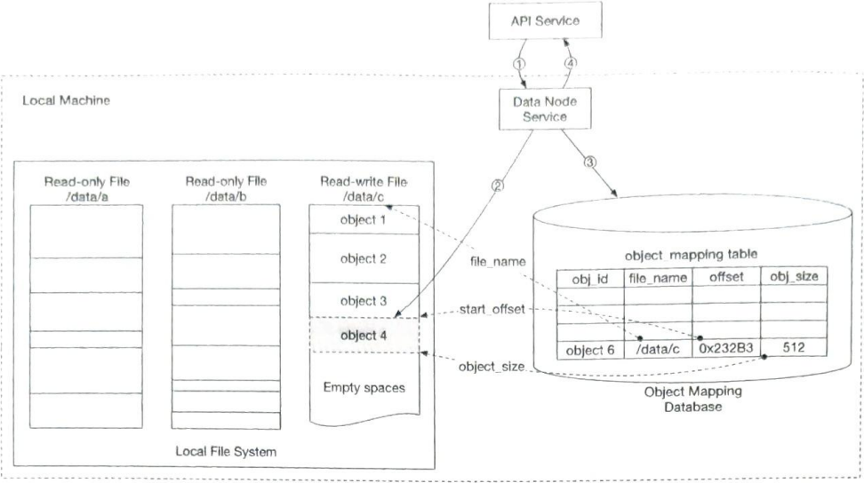
</p>

#### Erasure coding

Replicating full data makes sense with durability, but it costs xN times more. So we use erasure coding for cost reduction. It chunks data into smaller pieces and creates parities for redundancy. There are lots of algorithms to do this. This slows down access speed since we need to make mathematical calculation for getting a single file, but it's acceptable.

<p align="center">
    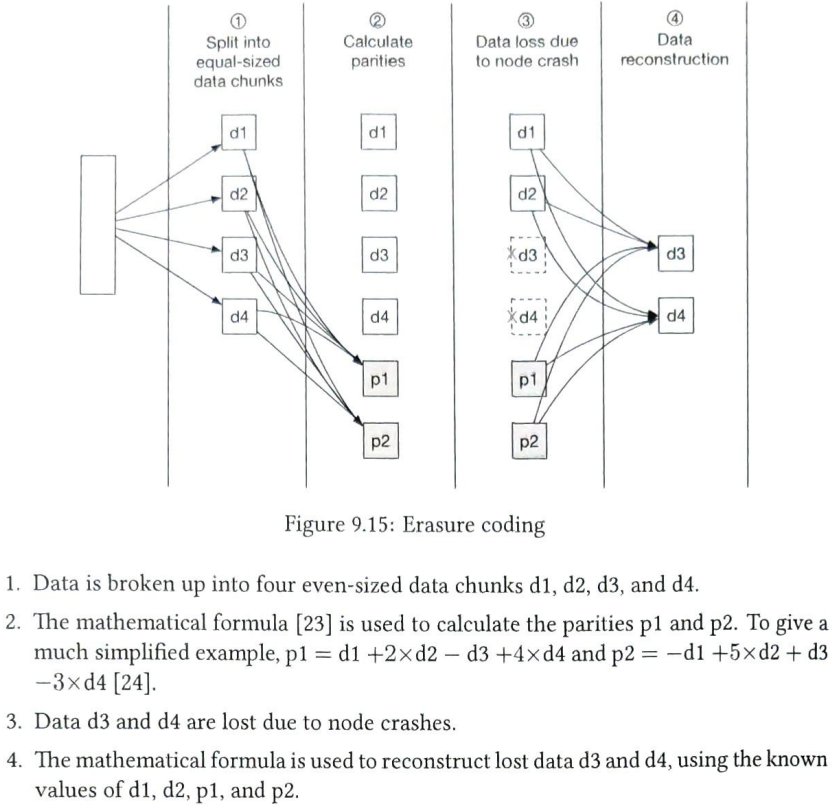
</p>

#### Correctness verification

There are many checksum algorithms like MD5, SHA1, HMAC, etc.
We save checksum with object, and check if that object is corrupted.

<p align="center">
    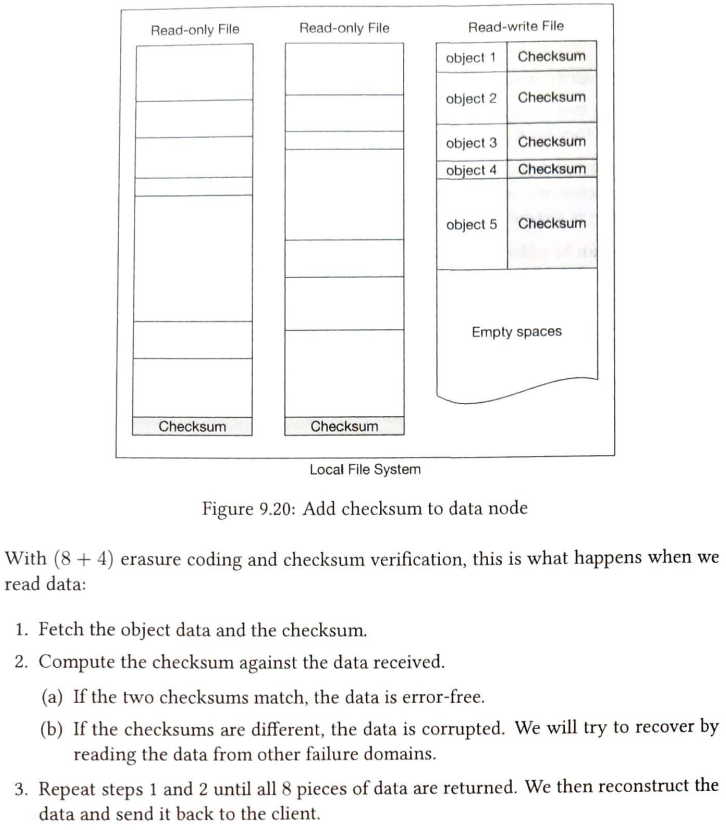
</p>


### 9.3.2. Metadata data model

Metadata Service must support these three queries: 
1. Find the object ID by object name
2. Insert and delete an object by object name
3. List objects in a bucket sharing the same prefix
<p align="center">
    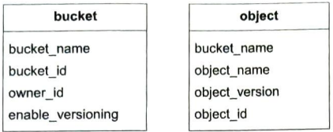
</p>

Bucket table is read intensive. So we spread the read load among multiple database replicas.

Object table is both read/write intensive. We should shard by (bucket_name, object_name) because most of the metadata operations are based on the object URI, which contains (bucket_name, object_name). 

### 9.3.3. Listing objects in a bucket

Object storage arranges file in a flat structure instead of a hierarchy, like a file system. But it supports hierarchy-like access:

```
s3://bucket-name/this/is/not/a/folder/file.txt

Bucket name: bucket-name
Object name: this/is/not/a/folder/file.txt
```
To provide pagination of listing objects, we could make separate table sharded with bucket id. This will not have optimal performance, but it greatly simplifies the implementation.

### 9.3.4. Object versioning

If `PUT` request comes:
- without `enable_versioning`, old version's metadata is replaced by the new version in the metadata store. Old version's document is marked as deleted, and garbage collector will reclaim that storage space. (same for versioning's `DELETE`)
- with `enable_versioning`, it just adds new document and metadata with new version.

<p align="center">
    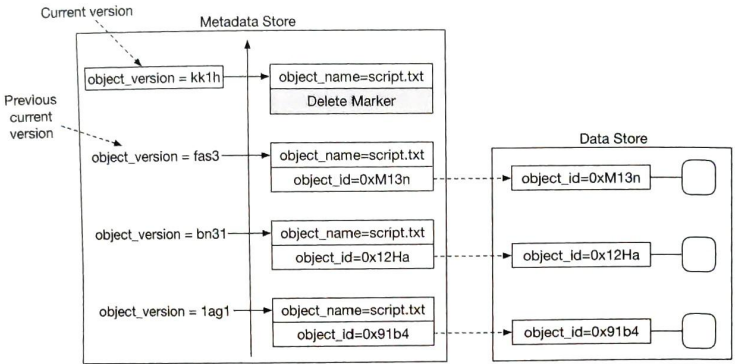
</p>


### 9.3.5. Optimizing uploads of large files

For large objects, we can provide `multipart upload` scheme.

<p align="center">
    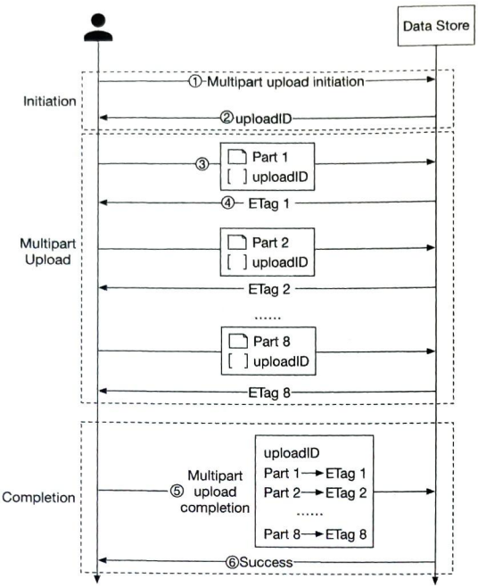
</p>
1~2 : Client calls object storage to initiate multipart upload. Server returns uploadID
3~4 : Client splits a file and start uploading with Part's ID and uploadID. Server returns ETag(checksum) for that file
5~6 : Client sends 'complete' message with uploadID, pairs of Part's ID and ETag. Server reassembles the object.

One problem is that splitted parts are no longer useful after reassemble. To solve this, gc must be implemented.

### 9.3.6. Garbage collection

<p align="center">
    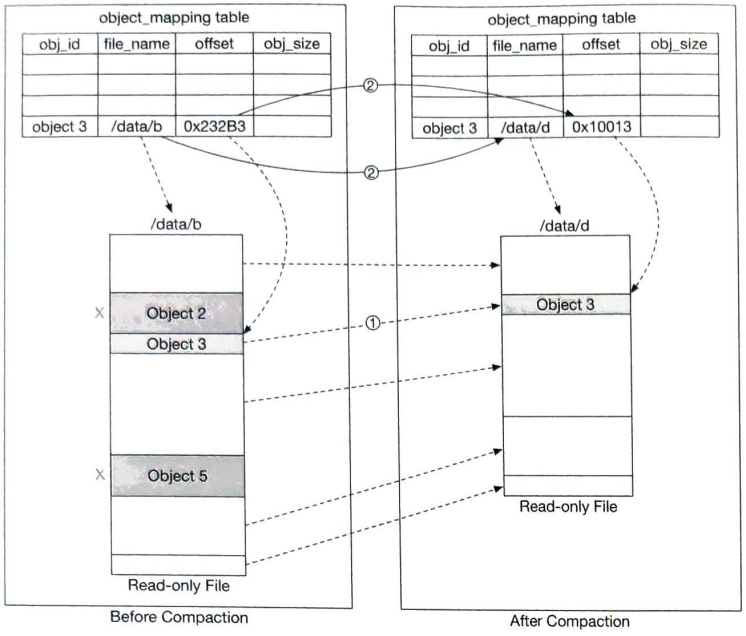
    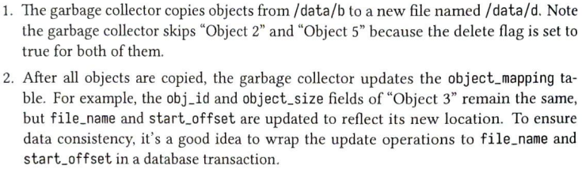
</p>

To avoid creating a lot of small files, gc waits until there are a large number of read-only files to compact, and makes many read-only files into a few large new files.